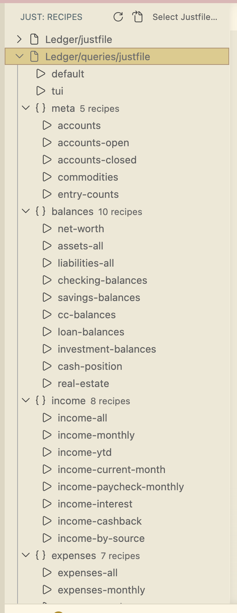

# Just Sidebar

A VS Code extension that surfaces [`just`](https://github.com/casey/just) recipes in a persistent sidebar tree view. Click a recipe to run it in an integrated terminal.

## Features

- **Sidebar tree view** — recipes listed under the "Just" activity bar icon
- **Click to run** — single click on any recipe sends the command to a terminal
- **Run with Args** — prompt for arguments before running parameterized recipes
- **Multi-justfile workspaces** — selector lets you switch between justfiles; choice persists across reloads
- **Doc comments** — recipe descriptions shown from `# comment` lines
- **Nix support** — optionally wraps `just` with `nix develop --command`
- **File watcher** — tree refreshes automatically when justfiles are saved

## Requirements

- `just` >= 1.13 (uses `--list-prefix`, `--list-heading`, `--unsorted`)
- VS Code >= 1.95.0

## Moving the view to the right sidebar

VS Code does not let extensions force a view into the secondary sidebar. To move Just Sidebar to the right:

1. Right-click the "J" icon in the activity bar
2. Select "Move to Secondary Side Bar"

This is a one-time action and persists across sessions.

## Settings

| Setting | Default | Description |
|---------|---------|-------------|
| `justSidebar.justBinary` | `"just"` | Path to the `just` binary |
| `justSidebar.useNix` | `"auto"` | Run inside `nix develop` if a `flake.nix` exists (`"auto"`, `"always"`, `"never"`) |
| `justSidebar.terminalReuse` | `true` | Reuse a single "Just" terminal instead of creating a new one each time |
| `justSidebar.searchDepth` | `3` | Max directory depth to search for justfiles |

## Recipe parameters

When running a recipe that has parameters, the "Run with Args" button (pencil icon) appears in the tree. Clicking it opens an input box where you can type arguments.

Arguments are passed as a raw shell fragment — your shell parses quotes and spaces. For example, to pass a value with a space: `"hello world"`.

## Workspace Trust

In untrusted workspaces, Just Sidebar will not list or run recipes. Trust the workspace (VS Code will prompt) to enable the extension.

## Nix environments

If your justfile lives next to a `flake.nix`, set `justSidebar.useNix` to `"auto"` (default) or `"always"` to prefix every recipe invocation with `nix develop --command`.

## Diagnostics

Errors are logged to the "Just Sidebar" output channel (View > Output, select "Just Sidebar").
